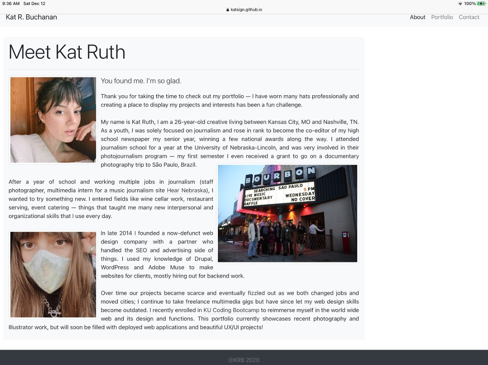
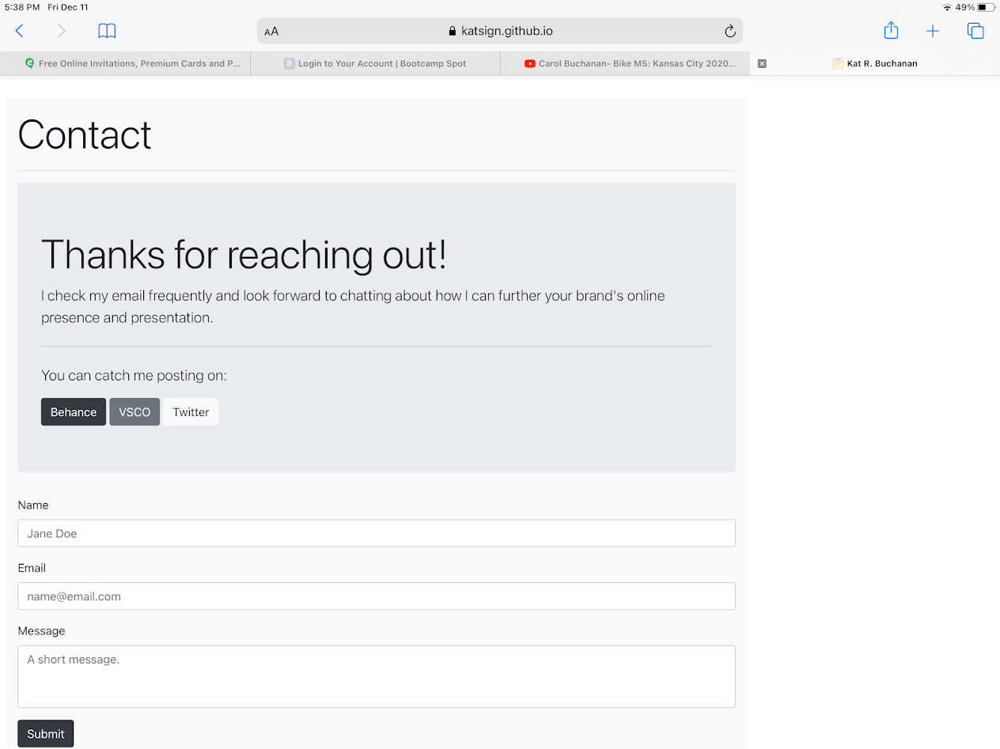
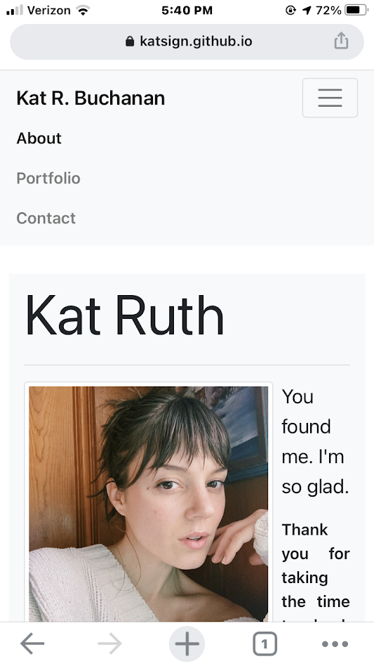
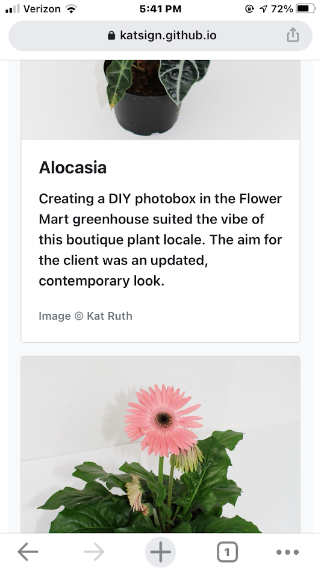
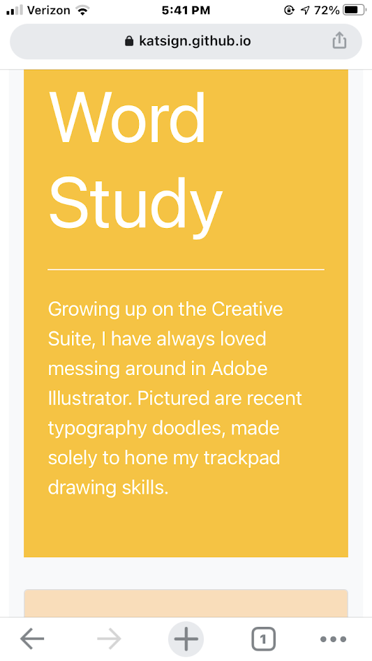
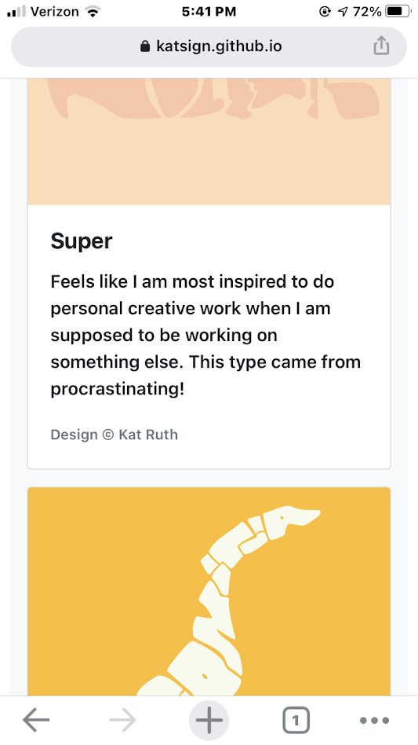

# My Responsive Portfolio

## Description
Using only pre-existing Bootstrap 4 CSS components, I built out a very simple but responsive personal portfolio site. The website consists of a main About page as the index with two pages branching off to highlight Porfolio work and include a Contact form. 

**Made with [Bootstrap v4.0](https://getbootstrap.com)**

### Links to Deployed Pages:
* https://katsign.github.io/responsive-portfolio/index.html
* https://katsign.github.io/responsive-portfolio/portfolio.html
* https://katsign.github.io/responsive-portfolio/contact.html

## Responsiveness
Because Bootstrap is designed with mobile and tablet devices in mind, using the built-in components made it much easier to design pages that scale with the browser window. I utilized the grid system, placing containers into areas with defined rows to space out my content on the page.

Resizing the width of my browser window (992px, 768px, 400px) with Dev Tools ensured that my content looked the way I wanted it to on different screen sizes. I noticed that the smallest size on my phone looked different than the smallest size on a desktop and made changes accordingly. I sent my deployed link out to friends and family, having them test the pages on different broswers and devices.

I wanted to match the example images in my assignment folder while also adding a personal touch to my design. I enjoy clean spaces online that use pops of color sparingly and let the featured work speak for itself. The Bootstrap Card components helped me easily create scalable rows of content for my Portfolio page.

## Cross-Browser Compatibility Examples

### Tablet, Safari:

  

### Phone, Chrome:

iPhone SE 2020            |  Google Chrome
:-------------------------:|:-------------------------:
  |  

iPhone SE 2020            |  Google Chrome
:-------------------------:|:-------------------------:
  |  

## Challenges and Future Additions
The main challenge I ran into was making sure the footer stayed "sticky" at the bottom of the page, regardless of short content. I couldn't seem to figure out a way to achieve this without altering or adding CSS, possibly because I used a previous Bootstrap version. With my limited knowledge of JavaScript, I was also unable to make the form submit to my email address. I plan on building these components out to function correctly as I learn more about how to make my websites dynamic.

## Credits
Entirely made with [Bootstrap 4.0](https://getbootstrap.com) components, using direction from the [Bootstrap 4.0 Documentation](https://getbootstrap.com/docs/4.0/getting-started/introduction/).
