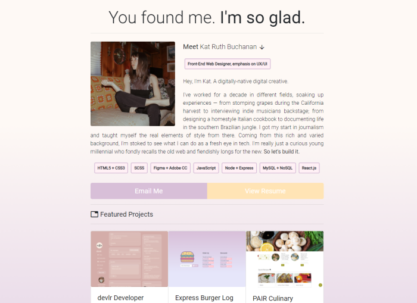

# Meet Kat Ruth | digitalNative, digitalCreative 💫

#### 📍 [View Deployment on GitHub Pages](https://katsign.github.io/portfolio1.0/) 📍

## *Description*
Using Bootstrap 4 CSS components, I built out a very simple but responsive web development portfolio site. The website consists of a single-scroll page featuring three main projects I've worked on.

These projects rotate out as I complete new ones in my full-stack bootcamp.

## *Screenshots*

[Portfolio Preview](https://katsign.github.io/portfolio1.0/)           |  [devlr Developer Network](https://devlr.herokuapp.com/)
:-------------------------:|:-------------------------:
  |  

[Express Burger Log](https://katsign-gotta-eat.herokuapp.com/)           |   [PAIR Culinary Curation](https://brandyquinlan.github.io/PAIR/)
:-------------------------:|:-------------------------:
  |  

## *Contact*
🔗 Links in Bio @[katsign](https://github.com/katsign)

---
&copy; 2021
