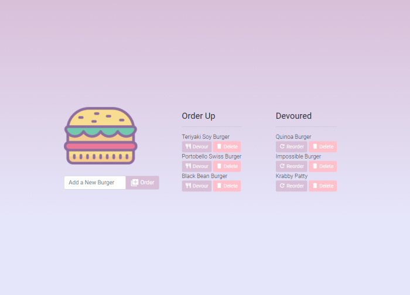

# Meet Kat Ruth | digitalNative, digitalCreative 🎇💭

## *Description*
Using Bootstrap 4 CSS components, I built out a very simple but responsive web development portfolio site. The website consists of a single-scroll page featuring three main projects I've worked on.

These projects rotate out as I complete new ones in my full-stack bootcamp.

### *Link to Deployed Page:*

* https://katsign.github.io/portfolio1.0/

## *Screenshots*

devlr Developer Network           |  PAIR Culinary Curation
:-------------------------:|:-------------------------:
  |  

## *Questions?*
💫 Links in Bio @[katsign](https://github.com/katsign)

---
This project is MIT licensed. &copy; 2021
